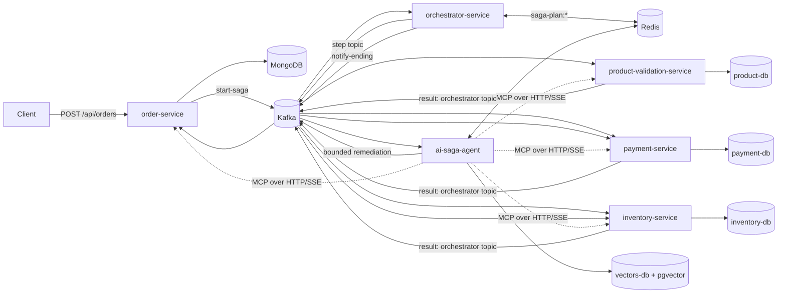
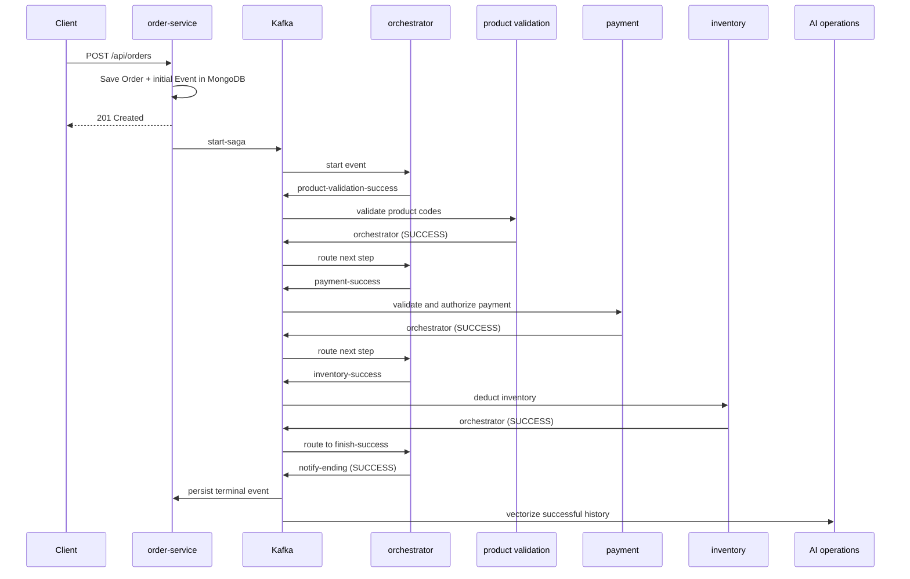
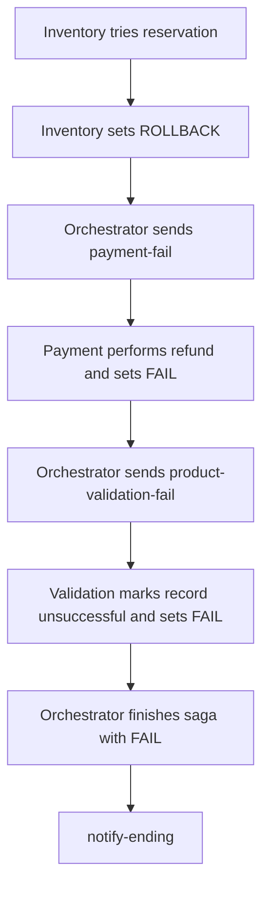
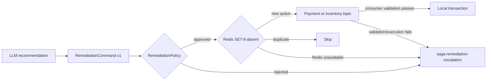

# ResilientFlow AI: Concepts and Implementation Guide

This guide explains the repository from first principles. It is based on the code and configuration currently present in the repository. Where the code contains an unfinished feature, a risky default, or a mismatch, the guide says so explicitly.

## 1. The problem this project solves

Imagine an online order that must pass through several independent systems:

1. confirm that every product code is valid;
2. charge the customer;
3. reserve inventory;
4. report the final result.

In a monolith, one database transaction could often commit or roll back all of these changes together. In microservices, each service owns a different database. A normal database transaction cannot atomically cover MongoDB, several PostgreSQL databases, Kafka, and an external payment gateway.

This repository solves that coordination problem with the **Saga pattern**. A saga is a sequence of local transactions. If a later step fails, earlier successful steps receive compensating commands. A compensation does not rewind time; it performs a new business action that semantically undoes the earlier one, such as refunding a payment.

The project then adds a second concern: **operations after a terminal failure**. A separate AI service observes completed sagas. Successful and failed histories become vector-searchable incident data. For a failed saga, the service can retrieve similar histories, ask a language model for a structured diagnosis, validate any proposed remediation against deterministic safety rules, and either dispatch a bounded compensation or escalate to a human.

An analogy:

- The **orchestrator** is an air-traffic controller directing each business step.
- **Kafka** is the radio network carrying instructions and replies.
- Each business service is a specialist team with its own records.
- A **compensation** is a corrective flight instruction after something has already happened.
- The **AI agent** is the incident analyst. It may recommend an action, but hard-coded policy is the security officer that decides whether the action is allowed.

## 2. What is actually implemented

The repository contains six runnable Spring Boot applications plus one shared Java library:

| Module | Port | Main responsibility | State |
|---|---:|---|---|
| `order-service` | 3000 | Accept orders, persist orders/events, publish saga starts, store final events | MongoDB |
| `orchestrator-service` | 8050 | Route events through forward and rollback steps | Redis for optional dynamic plans |
| `product-validation-service` | 8090 | Validate product codes and record validation results | PostgreSQL `product-db` |
| `payment-service` | 8091 | Fraud checks, simulated payment authorization, refunds | PostgreSQL `payment-db` |
| `inventory-service` | 8092 | Deduct stock, record before/after values, restore stock | PostgreSQL `inventory-db` |
| `ai-saga-agent` | 8099 | MCP analytics, RAG diagnosis, semantic cache, remediation policy/dispatch | PostgreSQL/pgvector and Redis |
| `saga-commons` | — | Shared event, order, history, JSON, and remediation types | Published to local Maven repository |

The normal static route is:

```text
product validation -> payment -> inventory
```

The code also supports a `FRAUD_VALIDATION` step inside `payment-service` when a dynamic Redis plan includes it. `SagaComposerService` automatically recomputes validated profile plans after startup and then every 30 minutes by default; an operator can also trigger recomputation through the agent API.

## 3. Architecture at a glance



There are two communication styles:

- **Asynchronous business flow through Kafka.** The order request returns after the order and initial event are created; the remaining saga continues in the background.
- **Synchronous operational queries through MCP over HTTP/SSE.** The DataAnalystAgent calls read-only tools exposed by business services.

This separation matters. Slow model calls do not sit in the original HTTP order request path.

## 4. The central message: `Event`

Every saga step passes a JSON representation of the shared `Event` class from `saga-commons`. Important fields include:

| Field | Meaning |
|---|---|
| `eventId` | Identifier for an event document |
| `transactionId` | Identifier that follows one saga execution |
| `orderId` | Identifier for the business order |
| `order` | Products, quantities, prices, customer profile, totals |
| `source` | The service that most recently handled the event |
| `status` | `SUCCESS`, `ROLLBACK`, `FAIL`, or `TIMEOUT` |
| `eventHistory` | Append-only-looking list of step results and messages |
| `createdAt` | Event creation time |

The status names have specific orchestration meanings:

- `SUCCESS`: this step succeeded; route forward.
- `ROLLBACK`: this step itself did not complete; ask an earlier successful step to compensate.
- `FAIL`: a compensation was attempted; continue backward or finish the saga as failed.
- `TIMEOUT`: assigned by the Redis-backed deadline monitor. The monitor publishes the expired saga to `finish-fail`, after which the normal terminal-failure path runs.

The history is more than a log. The remediation safety rules inspect it for explicit phrases such as `Rollback not executed for payment`. That makes history text part of the current machine-readable evidence model.

## 5. Kafka topics and message routing

Kafka is a durable distributed log. A **producer** appends a record to a named topic; a **consumer group** lets one member of the group process each partition record. Unlike a direct method call, the producer and consumer do not need to be running at the same instant.

The main topics are:

| Topic | Consumer/purpose |
|---|---|
| `start-saga` | Orchestrator starts a new saga |
| `orchestrator` | All business services return their latest result here |
| `product-validation-success` / `product-validation-fail` | Run validation / compensate validation |
| `fraud-validation-success` / `fraud-validation-fail` | Run / roll back the simulated fraud step |
| `payment-success` / `payment-fail` | Charge / refund |
| `inventory-success` / `inventory-fail` | Reserve / release stock |
| `finish-success` / `finish-fail` | Ask orchestrator to finish with the corresponding result |
| `notify-ending` | Deliver the terminal event to the order service and AI operations service |
| `saga-remediation-dlq-retry` | Application-level channel for generated remediation commands |
| `inventory-remediation` / `payment-remediation` | Service-specific approved remediation commands |
| `saga-remediation-escalation` | Commands that need a human operator |

`saga-remediation-dlq-retry` is the application command channel consumed by `RemediationRetryListener`. Listener failures are retried twice with a one-second fixed backoff; after the original attempt and those retries fail, Spring Kafka publishes the exhausted record to `saga-remediation-dlt`. A DLT audit listener persists it as an operational escalation.

All topics created by the service Kafka configurations use **one partition and replication factor one**. This is convenient locally, but it limits parallelism and provides no broker redundancy.

## 6. End-to-end flow: successful order



In more detail:

1. `OrderController` receives `POST /api/orders`.
2. `OrderServiceImpl` saves an `OrderDocument` to MongoDB. It generates the transaction ID and derives customer type from the number of existing orders: zero is `new`, at least ten is `vip`, otherwise `returning`. The request's `clientType` and `clientOrderCount` values are not used for this calculation.
3. `EventPublisherServiceImpl` stores an initial `EventDocument`, serializes it, and sends it to `start-saga`.
4. `SagaOrchestratedConsumer` calls `startSagaWithAI`. The orchestrator checks Redis for a profile plan. If no plan is present or Redis fails, the first topic defaults to product validation.
5. Product validation ensures the order and IDs exist, rejects a duplicate validation for the same order/transaction, and verifies each product code against the seeded catalog.
6. Payment calculates the total, requires at least R$15, applies per-order and new-customer limits, computes a simulated fraud score, checks a deterministic mock blacklist, and calls `SimulatedPaymentGateway`. The gateway approves 80% of random attempts and simulates four rejection classes for the remainder.
7. Inventory records `oldQuantity`, ordered quantity, and calculated new quantity in `OrderInventory`, then checks and deducts stock.
8. Each service appends a `History` entry and publishes the updated event to `orchestrator`.
9. When the last step succeeds, the orchestrator publishes the terminal event to `notify-ending`.
10. The order service stores the completed event. The AI service embeds the history and adds it to pgvector even when the saga succeeds, so successful histories also become retrieval context.

### Example order request

The seeded product codes are `COMIC_BOOKS`, `BOOKS`, `MOVIES`, and `MUSIC`.

```bash
curl -X POST http://localhost:3000/api/orders \
  -H "Content-Type: application/json" \
  -d '{
    "products": [
      {"product": {"code": "BOOKS", "unitValue": 25.0}, "quantity": 2}
    ],
    "customerId": "customer-101",
    "clientSuccessRate": 100.0,
    "hasDigitalProducts": false
  }'
```

The HTTP response confirms order creation, not end-to-end saga completion. Use `GET /api/events` to inspect terminal events later.

## 7. End-to-end flow: failure and compensation

Suppose product validation succeeds, payment succeeds, but inventory discovers insufficient stock.



The words can initially feel backwards. `ROLLBACK` means “my forward action failed; begin going backward.” A compensation handler then emits `FAIL`, which tells the orchestrator to continue the backward chain. Finally the orchestrator changes the terminal event to `FAIL`.

The static routing table lives in `SagaHandler` and is interpreted by `SagaExecutionController`. For example:

```text
INVENTORY_SERVICE + ROLLBACK -> inventory-fail
INVENTORY_SERVICE + FAIL     -> payment-fail
PAYMENT_SERVICE   + FAIL     -> product-validation-fail
PRODUCT_VALIDATION_SERVICE + FAIL -> finish-fail
```

Dynamic plans complicate this slightly. `SagaPlannerService` reads a list of steps from Redis and calculates the next forward topic or the previous rollback topic. If the lookup or parsing fails, forward routing can fall back to the static table. However, `handleFail` treats a `null` previous topic as the end of the rollback chain; `null` can also result from missing/broken plan data. This means the dynamic fallback behavior is not uniform across every branch.

## 8. AI diagnosis, RAG, caching, and remediation

### 8.1 Why the AI work is asynchronous

Language models and embedding models can take far longer than an ordinary database query. The AI service consumes `notify-ending` independently, after the business saga has reached a terminal state. Model latency therefore does not extend the original `POST /api/orders` request or block the business orchestrator.

Spring virtual threads are enabled for `ai-saga-agent`. Virtual threads make blocking Java tasks cheaper in terms of platform threads, but they do not make an external model respond faster and they do not remove Kafka or database capacity limits.

### 8.2 Retrieval-Augmented Generation (RAG)

An **embedding** converts text into a fixed-length list of numbers. Text with similar meaning should have nearby vectors. Here, Ollama's `nomic-embed-text` model produces 768-dimensional embeddings. pgvector stores them in the `saga_history_embeddings` table.

For a failed saga, `OperationsService`:

1. joins event history entries into text;
2. tries the Redis trace cache;
3. if needed, creates an embedding and tries the embedding cache;
4. if still uncached, searches pgvector for up to three matches with score at least `0.75`;
5. puts the failure, order amount, and retrieved histories into a prompt;
6. asks `OperationsAgent` for strict JSON;
7. converts the JSON into a versioned `RemediationCommand`;
8. publishes it to `saga-remediation-dlq-retry`;
9. stores the command JSON in the `saga_diagnostics` table;
10. adds the incident to the vector store unless it was an exact trace-cache hit.

RAG is like giving an incident analyst a small folder of related past cases before asking for an opinion. It grounds the response better than asking only from the model's general training, but similarity is not proof. That is why the model does not directly execute business operations.

### 8.3 Semantic diagnostic cache

The Redis cache has two keys for each diagnosis:

- a SHA-256 hash of a normalized history string;
- a SHA-256 hash of the embedding's raw float bytes.

Normalization lowercases text and replaces timestamps, UUIDs, hex addresses, long numbers, and repeated whitespace. Thus two failures that differ only in incidental IDs can share the exact-trace entry. The default TTL is 24 hours.

An exact trace hit skips embedding, vector search, and the LLM. An embedding-key hit skips vector search and the LLM, although exact equality of floating-point embedding bytes is stricter than a similarity search and may limit real-world hit rates. Redis read/write failures are handled as cache misses so diagnosis can continue.

The repository logs diagnosis latency in microseconds and whether each cache tier hit, but it contains no benchmark report. Claims such as “under 10 ms” should be measured in the target environment rather than treated as proven by this code.

### 8.4 Structured AI output

`OperationsAgent` is instructed to emit JSON with root cause, affected services, impact, pattern, recommendation, risk, and allowlisted actions. Allowed action types are:

- `RELEASE_INVENTORY`
- `REFUND_PAYMENT`
- `ESCALATE`

`DiagnosticDecisionParser` removes an optional Markdown fence and parses JSON. If the model call fails, JSON is malformed, or `rootCause` is absent, the code creates a safe escalation decision rather than guessing an executable action.

### 8.5 The deterministic safety boundary



`RemediationPolicy` enforces the following independently of the model prompt:

- schema version must be supported;
- remediation, order, and transaction identifiers must exist and match the source event;
- only a terminal `FAIL` event is eligible;
- risk must be `LOW`, `MEDIUM`, `HIGH`, or `CRITICAL`;
- `CRITICAL` always requires a human;
- at most three actions are allowed and duplicate action types are rejected;
- every action needs an ID and a reason of 1–500 characters;
- release/refund requires explicit failed-rollback evidence in event history;
- refund percentage must be greater than 0 and at most 100%;
- the calculated automated refund must not exceed R$500;
- an explicit `ESCALATE` action is routed to humans, not executed.

Before publishing an approved action, `RemediationDispatchService` reserves a Redis idempotency key for 30 days with `SET IF ABSENT`. If Redis is unavailable, the system fails closed and escalates. If Kafka publishing fails, it attempts to remove the reservation and escalates.

The target service validates the command again. Inventory tracks a `released` flag on each `OrderInventory` row. Payment stores cumulative `refundedAmount` and treats a refund at or below the already-applied target as a duplicate. This is defense in depth: duplicate prevention exists both before dispatch and in business state.

## 9. Dynamic saga plans and MCP agents

### Dynamic plans

`SagaComposerService` generates plans for six profiles and stores each under `saga-plan:{profile}` for 30 minutes by default. It uses operational metrics fetched through MCP, stock alerts, and up to five vector matches with score at least `0.70`. Plan steps are checked against an allowlist and duplicates are rejected before a plan is saved.

The scheduler starts after a configurable initial delay (10 seconds by default), recomputes every 30 minutes, and writes plans with a matching 30-minute TTL. `POST /api/agent/composer/recompute` provides a manual trigger. The orchestrator distinguishes “rollback complete” from “plan unavailable”; only the latter falls back to the static state table. Redis or model failure still leaves the deterministic static saga as the dependable baseline.

### MCP: giving an AI controlled tools

MCP, the Model Context Protocol, standardizes how a model-facing client discovers and invokes tools. Each business service registers an MCP server at `/sse` with a message endpoint at `/mcp/message`.

Examples of exposed read tools include:

- Order: get an order, latest event by order/transaction, or recent events.
- Product validation: verify a product code, check a validation record, list the catalog.
- Payment: inspect payment state/counts and calculate fraud-related information.
- Inventory: inspect a product and low-stock records.

`DataAnalystAgentService` connects to the order, product, payment, and inventory MCP servers and permits up to five sequential tool calls. The orchestrator MCP URL is configured but its client is commented out in `McpClientConfig`.

The interactive endpoint is:

```text
GET http://localhost:8099/api/agent/chat?question=...
```

Other AI endpoints are:

```text
GET /api/agent/diagnostics
GET /api/agent/composer/plans
GET /api/agent/escalations
POST /api/agent/composer/recompute
```

When `APP_API_KEY` is configured, REST and MCP endpoints require the same value in the `X-API-Key` header. The AI MCP client forwards it automatically. Leaving the variable empty keeps authentication disabled for local development.

## 10. Repository structure and important files

```text
.
├── saga-commons/                  shared contracts used on Kafka
├── order-service/                 HTTP entry point and Mongo event history
├── orchestrator-service/          static state table and Redis plan routing
├── product-validation-service/    catalog validation and compensation
├── payment-service/               fraud, payment gateway, and refunds
├── inventory-service/             stock reservation and release
├── ai-saga-agent/                 agents, RAG, caching, policy, dispatch
├── prometheus/prometheus.yml      local scrape targets
├── docker-compose.yml             local infrastructure and five business apps
├── build-all.sh                   publishes commons and builds applications
├── Saga-Bruno.zip                 API request collection
└── readme.md                      short project overview
```

Inside a typical service:

```text
src/main/java/.../
├── config/       Kafka, Redis, JPA, model, or MCP wiring
├── controller/   HTTP adapters
├── consumer/     Kafka input adapters
├── producer/     Kafka output adapters
├── service/      business/application logic
├── repository/   database access interfaces
├── model/        persisted entities/documents
└── dto/          boundary data structures

src/main/resources/
├── application.yml   ports, topics, database URLs, model settings
├── import.sql        seed data in catalog/inventory services
└── init-vectors.sql  enables PostgreSQL's vector extension
```

Files worth reading in order:

1. `saga-commons/.../dto/Event.java` and `History.java` — understand the traveling message.
2. `order-service/.../OrderServiceImpl.java` and `EventPublisherServiceImpl.java` — see saga creation.
3. `orchestrator-service/.../SagaHandler.java` — see the static state machine in one table.
4. `SagaOrchestratedConsumer.java` and `OrchestrationService.java` — see how events enter routing.
5. Each business service's consumer and service class — see local work and compensation.
6. `ai-saga-agent/.../OperationsService.java` — follow the full diagnostic pipeline.
7. `RemediationPolicy.java`, `RemediationDispatchService.java`, and the two remediation consumers — understand the safety boundary.
8. `docker-compose.yml` and every `application.yml` — understand runtime dependencies.

## 11. Technologies: what, why, and how they are used

### Java 21 and Spring Boot

Java supplies the language and runtime. Spring Boot creates each standalone web/application process and wires dependencies through constructor injection. Spring MVC exposes HTTP controllers, Spring Kafka provides listeners/templates, Spring Data provides MongoDB/JPA/Redis access, and Actuator exposes health and metrics endpoints. Java 21 virtual threads are enabled only in the AI service configuration.

### Gradle and Maven Local

Each module is a separate Gradle build with its own wrapper; there is no root multi-project `settings.gradle`. `saga-commons` is published as `com.learn:saga-commons:0.0.4-SNAPSHOT` to the developer's local Maven repository, then each service resolves it using `mavenLocal()`.

Tradeoff: separate builds reinforce service independence, but a shared snapshot artifact introduces a manual publish step and schema-coupling risk. A production setup would normally publish immutable versions to an artifact repository and apply event-schema compatibility rules.

### MongoDB and PostgreSQL

MongoDB stores variable-shaped order and event documents and makes the order service's document model direct. PostgreSQL stores structured transactional records for validation, payment, and inventory. Separate databases preserve service ownership: one service should not update another service's tables.

The AI service uses PostgreSQL both for ordinary `saga_diagnostics` rows and, through pgvector, 768-dimensional history embeddings. This reduces the number of database products required compared with adding a dedicated vector database, at the cost of sharing relational database resources with vector search.

### Redis

Redis is an in-memory key/value server used for three different ephemeral concerns:

1. two-tier diagnostic cache entries with 24-hour TTL;
2. generated saga plans with two-minute TTL;
3. remediation idempotency reservations with 30-day TTL.

The failure behavior differs deliberately: cache failure is bypassed, plan failure falls back, but idempotency failure blocks automatic compensation.

### LangChain4j and model providers

LangChain4j turns annotated Java interfaces into model-backed services and integrates chat models, embeddings, MCP tools, and pgvector. The primary chat model setting supports Gemini, Claude, thinking Ollama, or non-thinking Ollama. Configuration currently defaults to Gemini 2.5 Flash. Embeddings always use local Ollama `nomic-embed-text`, regardless of the selected chat model.

Temperature is set to zero for Gemini and Ollama to reduce variation, but model output is still untrusted and must be parsed and policy-checked.

### JPA/Hibernate and Spring Data

JPA maps Java entities to PostgreSQL tables; repositories generate common queries. Mongo repositories do the equivalent for documents. `@Transactional` wraps the automated refund and inventory-release database work locally. It cannot create one transaction spanning Kafka and every database.

### Docker Compose, Prometheus, and Grafana

Compose defines MongoDB, four PostgreSQL instances including pgvector, Redis, a Kafka image, Redpanda Console, all six applications, Prometheus, and Grafana. Prometheus scrapes all six applications every 15 seconds at `/actuator/prometheus`.

## 12. Architectural style and tradeoffs

### Orchestration versus choreography

This is primarily an **orchestrated saga**: a central service chooses the next topic. Business services do not independently decide the whole workflow.

- Benefit: the state-transition policy is visible centrally and easier to reason about.
- Cost: the orchestrator knows service/topic names and becomes an important availability component.
- Alternative: pure choreography, where services react to business events without a central router. That reduces central control but can make the global flow hard to understand.

### Hexagonal architecture: partial, not strict

Kafka listeners and controllers behave as inbound adapters, and repositories/Kafka producers behave as outbound infrastructure. `PaymentGateway` is a clear outbound port with `SimulatedPaymentGateway` as its adapter.

However, application services also depend directly on Spring Data repositories and concrete Kafka producer classes. Domain DTOs carry framework/Lombok conventions, and there are no consistent domain-level port interfaces around all persistence/messaging operations. It is therefore fair to describe the project as layered and **influenced by ports-and-adapters**, not a strict hexagonal implementation everywhere.

### Static versus AI-generated routing

- Static `SagaHandler`: deterministic, fast, easy to test, but fixed.
- Redis plan: can adapt by customer profile and observed failures, but introduces model quality, expiry, parsing, and availability concerns.

The code keeps a static path as a fallback, which is a sound general design, though the current dynamic implementation has the limitations listed earlier.

### Shared event object versus small domain events

Passing one growing `Event` simplifies correlation and gives the AI a full history. It also couples services to a shared schema, increases message size, and allows one service to overwrite fields owned conceptually by another. An alternative is immutable, versioned events per step plus a dedicated saga state store.

### Semantic cache versus correctness

Caching saves model calls and latency. Normalization increases reuse but can accidentally collapse incidents whose differing numbers matter. Cached AI decisions also age until their TTL. The deterministic policy and revalidation at the target service limit the damage, but cache design should be evaluated with real incident data.

## 13. Scalability and performance

Current helpful properties:

- HTTP order acceptance is separated from downstream processing.
- Different saga steps can run in different services and scale independently.
- Consumer groups provide a route to horizontal consumers.
- exact diagnostic cache hits avoid embedding, vector search, and model inference;
- pgvector search retrieves only a small top-k context instead of passing every incident to the model;
- virtual threads reduce the cost of blocking waits in the AI application.

Current bottlenecks and improvements:

- Every topic has one partition, so one consumer group can process only one record at a time per topic. Increase partitions and key records by a stable saga/order identifier when ordering requirements are defined.
- Replication factor one means one broker failure loses availability and may lose data. A production cluster normally uses multiple brokers and replication.
- Saga producers wait up to ten seconds for broker acknowledgement and enable Kafka's idempotent producer with `acks=all`. This detects delivery failure before a service reports publishing success, although it does not make a database write and Kafka send one atomic transaction.
- pgvector is created without an index declaration in application code. As incident volume grows, consider an appropriate vector index and measure recall/latency.
- `listRecentEvents` reads all Mongo events and then applies Java `stream().limit(limit)`. A database-side limited query would scale better.
- `show-sql: true`, verbose payload logging, and model request/response logging add overhead and may expose data.

No load-test scripts or recorded throughput/latency results are present. Performance targets must be benchmarked rather than inferred from architecture.

## 14. Reliability and consistency

The Saga pattern supplies business-level recovery, not automatic exactly-once processing.

Important current behaviors:

- Local database writes and Kafka sends are not atomic. For example, an order/event can be saved but `start-saga` can fail to publish. The `@Transactional` annotation on order creation does not create a distributed MongoDB-plus-Kafka transaction.
- A transactional outbox would close this gap: save the business row and an outbox row together, then reliably relay the outbox to Kafka.
- Business-step duplicate checks exist, and remediation has explicit idempotency, but forward consumers do not all have a uniform inbox/deduplication mechanism.
- Consumer offset reset is `latest` for business services and `earliest` for the AI service. A brand-new business consumer group can skip pre-existing records; the AI group can replay all retained terminal records.
- `depends_on` in Compose controls start order, not readiness. There are no health checks, so applications can start before their databases or Kafka are ready.
- The orchestrator registers a two-minute deadline in a Redis sorted set, stores the latest event snapshot, and scans every five seconds. A short Redis lock prevents two orchestrator instances from publishing the same timeout. Redis failure is logged without blocking the core saga.
- Inventory creates `OrderInventory` records before checking all stock and is not transactionally wrapping the whole forward reservation method. A failure partway through a multi-product update can leave partial local state.
- The AI listeners have retry/DLT handling. The five business services still do not have a uniform framework-level DLT policy for malformed messages or exhausted retries.

For production, consider outbox/inbox patterns, explicit retry/backoff and DLQs, timeouts, circuit breakers, readiness probes, multi-broker Kafka, database migrations, and end-to-end correlation metrics.

## 15. Security considerations

Safety mechanisms already present:

- AI actions are enum-limited and parsed as structured data.
- hard-coded policy caps actions and refund amounts;
- source IDs and terminal status are checked;
- failed-rollback evidence is required;
- critical risk and explicit escalation are never auto-executed;
- Redis idempotency failure causes fail-closed behavior;
- target services validate commands again.

Development-only or missing controls:

- Database passwords are committed as simple defaults in Compose/configuration.
- Kafka uses plaintext listeners without authentication or TLS.
- REST and MCP endpoints support an optional shared API key. There is still no user-level RBAC, and Actuator, Grafana, and Redpanda Console require deployment-level access controls.
- Actuator exposes all endpoints and health details.
- Model and MCP request/response logging can include order/customer data.
- No message signature proves that a remediation command came from the trusted AI service.
- The original source event is embedded inside the remediation command and is not cryptographically immutable.
- Input validation is limited: for example, only the product list itself is `@NotNull`; quantities/prices do not have comprehensive bean-validation bounds.

A production design should use a secret manager, TLS and Kafka ACLs, service identities, endpoint authentication/RBAC, least-privilege database accounts, audit logs, PII redaction, signed commands, network policies, and tighter request schemas.

## 16. Setup and run guide

### Prerequisites

- JDK 21
- Docker with Docker Compose
- Bash for `build-all.sh` (Git Bash or WSL on Windows is sufficient)
- Ollama running locally with the embedding model
- Gemini and Claude API keys for the current default bean configuration

The chat-model configuration constructs Gemini, Claude, and Ollama beans, not only the selected primary model. Because `GEMINI_API_KEY` and `CLAUDE_API_KEY` have no defaults in `application.yml`, set both for the current code even if Gemini is primary.

### Step 1: prepare Ollama

```bash
ollama pull nomic-embed-text
ollama pull qwen3:8b
```

`nomic-embed-text` is always required for embeddings. `qwen3:8b` is needed only when using the configured Ollama chat option, but having it locally makes switching easier.

### Step 2: start infrastructure

From the repository root:

```bash
docker compose up -d order-db product-db payment-db inventory-db vectors-db redis kafka redpanda-console prometheus grafana
```

Useful local UIs:

- Redpanda Console: `http://localhost:8081`
- Prometheus: `http://localhost:9090`
- Grafana: `http://localhost:3001`

### Step 3: publish the shared library and build

On Bash:

```bash
./build-all.sh --with-tests
```

The script publishes `saga-commons` first and then builds the six applications. By default it skips tests unless `--with-tests` is supplied. Its API-key precheck mentions `OPENAI_API_KEY`, but the current application configuration actually references Gemini and Claude keys.

Use JDK 21 for the Gradle commands, not merely any newer JDK. During this repository inspection, `JAVA_HOME` pointed to JDK 26 and Gradle 8.11.1 failed while creating the `test` task with `Type T not present`. Pointing `JAVA_HOME` to an installed JDK 21 is the appropriate first fix for that environment/toolchain incompatibility.

Manual equivalent, shown for PowerShell:

```powershell
cd saga-commons
.\gradlew.bat publishToMavenLocal
cd ..

$services = @(
  'order-service', 'orchestrator-service', 'product-validation-service',
  'payment-service', 'inventory-service', 'ai-saga-agent'
)
foreach ($service in $services) {
  Push-Location $service
  .\gradlew.bat build
  Pop-Location
}
```

### Step 4: run the applications

Open a terminal for each module and run its wrapper:

```powershell
cd order-service
.\gradlew.bat bootRun
```

Repeat for orchestrator, product validation, payment, and inventory. Start the AI service with its required environment variables:

```powershell
$env:GEMINI_API_KEY = 'your-gemini-key'
$env:CLAUDE_API_KEY = 'your-claude-key'
cd ai-saga-agent
.\gradlew.bat bootRun
```

`docker-compose.yml` can build all six applications only after their JARs already exist because each Dockerfile copies `build/libs/*.jar`; these are not multi-stage source builds. The AI container reaches host Ollama through `host.docker.internal` by default.

### Step 5: submit and observe an order

Submit the earlier `curl` request, then inspect:

```bash
curl http://localhost:3000/api/events
curl http://localhost:8099/api/agent/diagnostics
curl "http://localhost:8099/api/agent/chat?question=List%20the%20five%20most%20recent%20sagas"
```

Order-service OpenAPI support is enabled; with the included Springdoc dependency, Swagger UI is normally available at `http://localhost:3000/swagger-ui/index.html`.

### Environment variables

| Variable | Default | Used for |
|---|---|---|
| `KAFKA_BROKER` | `localhost:9092` | Kafka bootstrap address |
| `MONGO_DB_URI` | local admin URI | Order MongoDB |
| `DB_HOST`, `DB_PORT`, `DB_NAME`, `DB_USER`, `DB_PASSWORD` | service-specific local values | Business PostgreSQL services |
| `VECTORS_DB_*` | localhost:5435/postgres defaults | AI relational/vector store |
| `REDIS_HOST`, `REDIS_PORT` | localhost:6379 | Cache, plans, idempotency |
| `DIAGNOSTIC_CACHE_TTL` | `PT24H` | Java `Duration` for cache entries |
| `GEMINI_API_KEY`, `CLAUDE_API_KEY` | none | Hosted chat-model clients |
| `GEMINI_MODEL` | `gemini-2.5-flash` | Gemini model |
| `OLLAMA_BASE_URL` | `http://localhost:11434` | Local Ollama server |
| `OLLAMA_MODEL` | `qwen3:8b` | Ollama chat model |
| `*_MCP_URL` | each service's local `/sse` | AI MCP connections |
| `APP_API_KEY` | empty (disabled) | Shared REST/MCP API key |
| `SAGA_PLAN_TTL` | `PT30M` | Dynamic-plan lifetime |
| `SAGA_TIMEOUT` | `PT2M` | Overall saga deadline |

## 17. Testing

Run a module's tests from inside that module:

```powershell
.\gradlew.bat test
```

Or run the Bash aggregate build with tests:

```bash
./build-all.sh --with-tests
```

The repository contains unit tests for:

- order controller, filtering, publishing, and service behavior;
- static orchestrator routing;
- product validation, payment, and inventory logic;
- diagnostic JSON parsing;
- remediation safety policy;
- semantic-cache normalization.

Most tests use mocks and validate a class in isolation. There are no full Docker-based integration tests covering Kafka plus all databases, no contract tests for event compatibility, and no load tests. For learning, add tests in layers:

1. unit-test each state transition and policy boundary;
2. use Testcontainers for Kafka, MongoDB, PostgreSQL/pgvector, and Redis;
3. submit an order and assert the eventual terminal event;
4. inject failures and assert compensation order and idempotency;
5. stub model output so AI pipeline tests are deterministic;
6. load-test topic partitioning, consumer lag, and cache effectiveness.

## 18. A practical way to understand the code

Do not begin with the AI classes. First make the deterministic saga concrete:

1. Start infrastructure and only the five business services.
2. Create one valid order and watch Kafka topics in Redpanda Console.
3. Read the event history returned by `/api/events` and map each entry to a consumer method.
4. Force a product or inventory failure and trace the rollback topics backward.
5. Read `SagaHandler` until every row makes sense.
6. Start the AI service and observe how the same terminal event is embedded or diagnosed.
7. Read policy code before prompts; policy is the real authority.
8. Inspect Redis keys for cache, plans, and idempotency, noting their different TTLs.

When debugging, always follow `transactionId`. `orderId` identifies the order, but `transactionId` identifies one saga execution. Then inspect, in order: current `source`, current `status`, the last history entry, the Kafka topic, and the database row owned by that service.

## 19. Current implementation checklist

The following summary prevents planned ideas from being confused with shipped behavior:

| Capability | Current state |
|---|---|
| Static Kafka saga and compensations | Implemented |
| Mongo/PostgreSQL service-owned persistence | Implemented |
| Fraud step | Implemented in payment service; used only when routed by a dynamic plan |
| AI failure diagnosis with RAG | Implemented |
| Redis trace/embedding cache | Implemented |
| Structured remediation topic | Implemented as an application Kafka channel |
| Hard-coded action safety policy | Implemented |
| Inventory release / partial refund remediation | Implemented with local duplicate checks |
| Human escalation publication/audit | Implemented and queryable at `/api/agent/escalations` |
| MCP operational chat | Implemented for four business services |
| Automatic saga-plan recomputation | Implemented with scheduler and manual endpoint |
| AI service in Docker Compose | Implemented |
| API authentication | Optional shared API key implemented; RBAC/TLS/Kafka ACLs remain deployment work |
| Saga timeout watchdog | Implemented with Redis deadlines and locking |
| Listener retry/DLT | Implemented for the AI service; business-service policy remains future work |
| Transactional outbox/inbox | Not implemented |
| Multi-broker, partitioned Kafka deployment | Not implemented |
| End-to-end integration/load benchmarks | Not present |

That distinction is essential to understanding the design: the repository is a strong learning prototype for event-driven sagas and guarded AI operations, while several production-hardening mechanisms remain future work.
